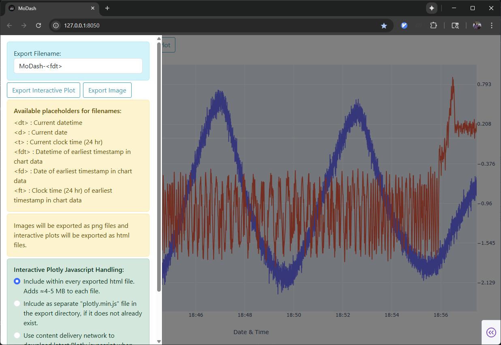

# MoDash

Tool for quick data visualization of MoSAIC-style tdms files stored locally or on an
external server

## Select single or multiple files, or drag and drop into drop zone

## Handles multiple files and channels on either axis

## Familiar plotly interface for graphs

## Configurable exports as either interactive html or static png file
Axes may be renamed and/or rescaled before export, and legend can be relocated.

